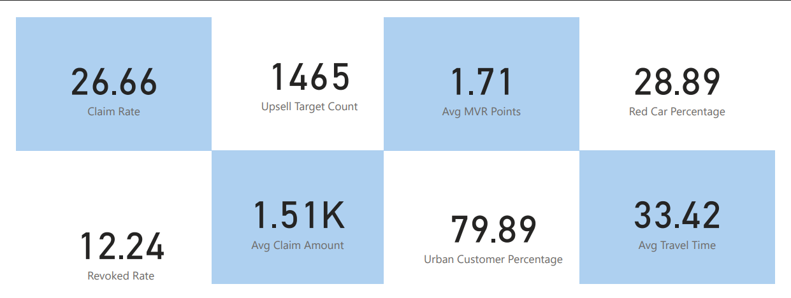
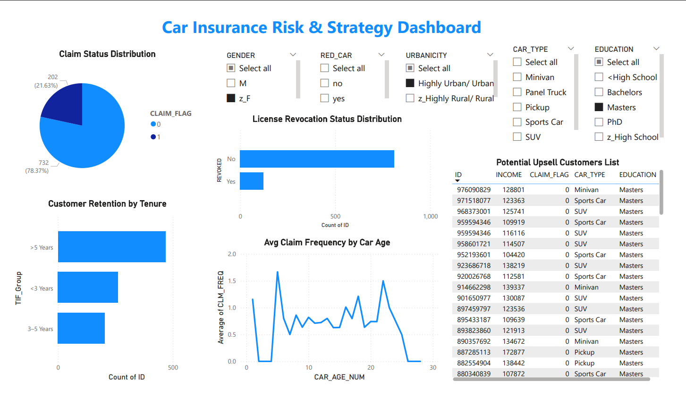

# 🚗 Car Insurance Risk & Strategy Dashboard

### 📊 BDAT 1009 – Enterprise Analytics Final Project  
**Team:** Hetkumar Patel, Dev Sompura, Krunal Solanki  
**Presentation Date:** March 16, 2025

---

## 🗂️ Overview

This project explores a comprehensive **Car Insurance dataset** with over **10,000 customer records** that include:

- 👤 Demographics  
- 🚗 Vehicle details  
- 📄 Claim history  
- ⚠️ Risk indicators  
- 🧭 Customer behavior  

The aim is to uncover **data-driven strategies** for:

- Underwriting optimization  
- Premium pricing  
- Risk detection  
- Upsell targeting  
- Policyholder retention  

---

## 🎯 Business Objectives

- Reduce **claim rates** and improve **underwriting accuracy**
- Identify **upsell opportunities** in low-risk customer segments
- Retain **long-term customers** through loyalty strategies
- Detect **fraud patterns** and **high-risk behavior**
- Leverage data for **personalized insurance offerings**

---

## 📌 SMART Goals

| Goal | Target |
|------|--------|
| 🔍 Improve underwriting accuracy | +20% using risk profiles |
| 📈 Boost upsell conversion | +15% via targeted campaigns |
| 🤝 Enhance customer retention | +25% with TIF loyalty offers |
| ⚠️ Detect risky profiles | Early warning using license & claim data |

---

## 📸 Dashboard Preview

### 🔷 Key Performance Indicators (KPIs)

- **Claim Rate:** 26.66%  
- **Upsell Target Count:** 1465  
- **Avg MVR Points:** 1.71  
- **Red Car %:** 28.89%  
- **Revoked License Rate:** 12.24%  
- **Avg Claim Amount:** $1.51K  
- **Urban Customer %:** 79.89%  
- **Avg Travel Time:** 33.42 mins  

---

### 📊 Full Dashboard View

> 📌 Use slicers to explore insights across:
> - Gender
> - Car Type
> - Education
> - Urbanicity
> - Red Car Flag

Included visualizations:
- Claim Distribution  
- Claim Frequency by Car Age  
- Revoked License Breakdown  
- Tenure Retention Groups  
- Potential Upsell Customer Table  

---

## 💡 Insights & Highlights

- 🔁 **~50%** of customers have **>5 years tenure**, showing loyalty.
- 🚫 **12.24%** have **revoked licenses**, signaling underwriting risks.
- 💰 **172 customers** are **ideal upsell prospects**:
  - High Income
  - Zero claims
  - Long tenure
  - Higher education

---

## 🧩 Strategic Recommendations

| Segment | Strategy |
|---------|----------|
| High-Risk Drivers | Stricter underwriting, higher premiums |
| Loyal Customers | Premium upsell, loyalty rewards |
| New Customers | Onboarding campaigns, welcome offers |

---

## 🔮 Future Scope

- 🧠 Integrate ML models for claim prediction  
- 🔗 Connect dashboards with CRM for personalized offers  
- 📊 Track behavior patterns for automated policy suggestions  
- 🧪 Run A/B tests for marketing optimization  

---

## 📁 Repository Contents

| File | Description |
|------|-------------|
| `final dashboard__car_Insurance_Claim.pbix` | Power BI Dashboard File |
| `car_insurance_data_clean.csv` | Cleaned Dataset |
| `Final_Presentation_Car_Insurance_Dashboard.pptx` | Presentation Slides |
| `README.md` | Project Documentation |

---

## 🙏 Acknowledgements

This project was developed to explore data-driven decision-making in the insurance industry using Power BI, with a focus on customer risk profiling, claim analysis, and upsell strategies

---

